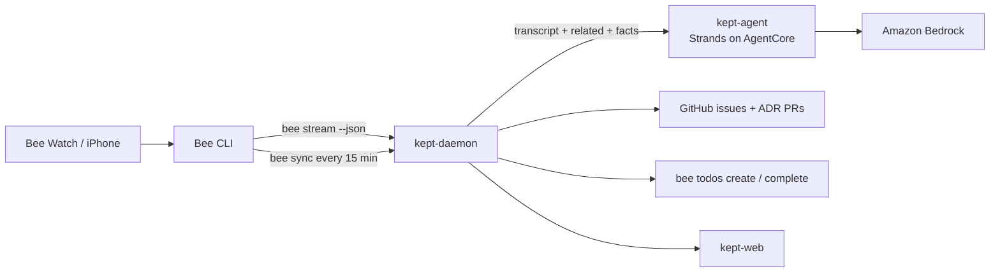

# Kept

**Bee remembers what you said. Kept makes sure you do it.**

Kept turns things a developer says out loud into tracked engineering work.
Bee (Amazon’s wearable AI) captures meetings. Kept listens to that stream,
extracts commitments, decisions, and asks, then files them where work
already lives: GitHub issues, Architecture Decision Records, and a Bee todo
on your wrist.

This is an open-source entry for the Bee track of the
[Build, Ship, Shape: Amazon Developer Hackathon](https://devpost.com).

**Status: Phase 0 — scaffold.** The dashboard, models, CI, and fixture
pipeline are in. The daemon that tails `bee stream` is Phase 1.

## What it does

1. **Commitments** — “I’ll fix the auth bug by Thursday” becomes a GitHub
   issue (quote, who it was made to, due date, link back to the Bee
   conversation) and a Bee todo on the watch.
2. **Decisions** — “we’re going with Postgres over Dynamo” becomes an ADR
   in the repo, with the transcript as evidence.
3. **Asks** — requests made of you land in the inbox if the agent is unsure.
4. **Ledger** — kept / at-risk / broken, with a nudge 24 hours before due.
   Closing the GitHub issue completes the Bee todo.

False positives are worse than misses. Confidence ≥ 0.75 auto-creates;
0.50–0.75 waits in the inbox; below 0.50 is dropped.

## Architecture



Three processes, one repo, Python 3.12, uv:

| Component | Role |
| --- | --- |
| `kept-daemon` | Subprocess on `bee stream --json`. On `conversation.state == processed`, fetch the transcript, call the agent, apply results. Fixture mode replays JSONL. |
| `kept-agent` | Strands + Bedrock, later hosted on AgentCore Runtime with Memory and Observability. |
| `kept-web` | FastAPI + HTMX dashboard: Ledger, Inbox, Decisions, Live. |

Bee MCP tools are used for context (related conversations, facts about
people). The daemon pre-fetches those rather than tunneling localhost MCP
into AgentCore — see [docs/FRICTION_LOG.md](docs/FRICTION_LOG.md).

## Privacy and consent

- Raw transcripts stay on the machine that runs the daemon. The only text
  that leaves for Bedrock is a redacted excerpt (quotes + speaker turns).
- `KEPT_REDACT` is a comma-separated list of names and terms scrubbed
  before any cloud call.
- Recording other people requires their consent. The dashboard stores a
  **recorded with consent** flag per conversation; Kept will not auto-create
  issues from a conversation that is not flagged.
- Do not commit `fixtures/real/` — it is gitignored.

## Quick start (fixture mode)

```bash
uv python install 3.12
uv sync --extra dev
uv run pytest -q
uv run kept web          # dashboard at http://127.0.0.1:8080
```

Copy `.env.example` to `.env`. Default `KEPT_MODE=fixture`.

## Capture live Bee fixtures

Kept is only as good as real meetings. On the Mac that is logged into Bee:

```bash
./scripts/capture-fixtures.sh
```

Full command list: [docs/FIXTURES.md](docs/FIXTURES.md).

## Bedrock model (enable before Phase 2)

Region **us-west-2**. Kept reads `BEDROCK_MODEL_ID` from the environment
and does not hardcode an ID. Confirm the ID in the Bedrock console for your
account before Phase 2 — names and inference-profile strings move.

Enable one of:

- Default: Claude Sonnet 4.6
- Cheap iteration: Claude Haiku 4.5
- AWS-native fallback: Nova 2 Lite

Details: [docs/AWS_INTEGRATION.md](docs/AWS_INTEGRATION.md).

## Phases

| Phase | What | Checkpoint |
| --- | --- | --- |
| 0 | Scaffold, license, CI, docs, dashboard shell | Capture fixtures from your Bee |
| 1 | Daemon in fixture mode → SQLite → parsed events | Run against live `bee stream` |
| 2 | Local Strands + Bedrock extraction | Review 10 real extractions |
| 3 | GitHub issues, ADR PRs, Bee todo write-back | Meeting → issue |
| 4 | AgentCore Runtime + Memory + Observability | Daemon hits the cloud endpoint |
| 5 | Reminders + reconciliation loop | Use it for five working days |
| 6 | Docs freeze, `v1.0.0`, demo video | Submit |

## Docs

- [AWS_INTEGRATION.md](docs/AWS_INTEGRATION.md)
- [PRODUCT_FEEDBACK.md](docs/PRODUCT_FEEDBACK.md)
- [FRICTION_LOG.md](docs/FRICTION_LOG.md)
- [FEATURE_REQUESTS.md](docs/FEATURE_REQUESTS.md)
- [FIXTURES.md](docs/FIXTURES.md)

## License

[MIT](LICENSE)
